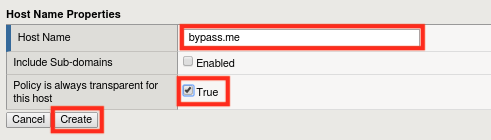

Lab 1.3: Blocking Mode Override
----------------------------------------

Task 1 - Enabling Transparent Mode for certain host names	
~~~~~~~~~~~~~~~~~~~~~~~~~~~~~~~~~~~~~~~~~~~~~~~~~~~~~~~~~~

#.  Navigate to **Security -> Application Security -> Headers -> Host Names**
#.  Click **Create**
	|lab3-1|
#.  Click **Create**  and then **Apply Policy**
