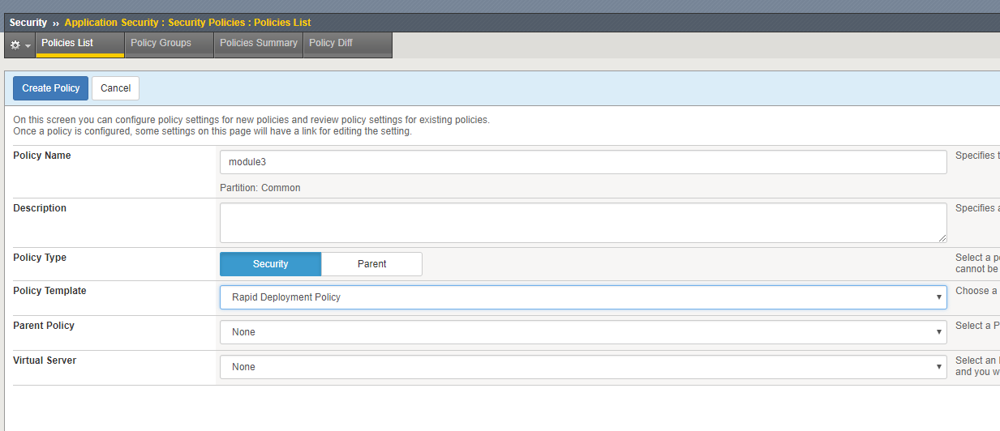
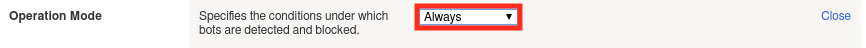
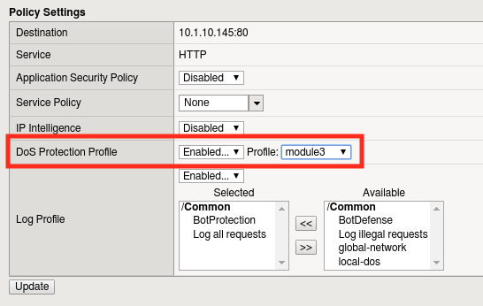

Lab 3.1: Bot Protection
----------------------------------------

In this lab we will investigate some of the features that comprise F5's Advanced WAF.  

.. |lab3-2| image:: images/lab3-2.png
        :width: 800px
.. |lab3-3| image:: images/lab3-3.png
        :width: 800px
.. |lab3-4| image:: images/lab3-4.png
        :width: 800px
.. |lab3-5| image:: images/lab3-5.png
        :width: 800px
.. |lab3-6| image:: images/lab3-6.png
        :width: 800px
.. |lab3-7| image:: images/lab3-7.png
        :width: 800px
.. |lab3-8| image:: images/lab3-8.png
        :width: 800px

.. |lab3b| image:: images/lab3b.png
        :width: 800px

Task 1 - Configuring Bot Defense
~~~~~~~~~~~~~~~~~~~~~~~~~~~~~~~~~~~~~~~~~~~~~~~~~~~~~

#. Browse to the BIGIP management console.

#. Create a New ASM policy by navigating to **Security -> Application Security -> Security Policies**.

#. Click **Create New Policy** and fill in the page as follows, then click **Create Policy**.

   |lab3-1|

#. Now lets create a DoS profile to go along with our WAF policy.

#. Navigate to **Security -> DoS Protection -> Dos Profiles** and then click the **Create** button.

   |lab3-2|

#. Click 'Create' to create a new DoS profile.

#. Name the profile "module3" and click 'Finished'.

#. Click the profile to configure.

   |lab3-3|

#. Select the 'Application Security' tab.

   |lab3-4|
#. Click "Edit", followed by the 'Enabled' checkbox to turn on Bot Detection.
	
   |lab3-5|

	
   |lab3-6|

#. Let's configure the types of bot protection that offer the best bang for the buck, starting with Signatures. Click the 'Bot Signatures' tab and click edit.
	
   |lab3-7|

#. Now click the 'Enabled' checkbox.  You'll see we can group bots by category or can select them uniquely. 
	
   |lab3-8|

#. Click 'Edit' to explore the settings further. Try to resist the urge to modify any settings, the defaults will serve us well.

#. For complete protection, let's go ahead an enable Proactive Bot Defense as well.  Click on the 'Proactive Bot Defense' tab, click 'Edit', and change the dropdown to "During Attacks".

	|lab3-9|

#. Click 'Update' to save changes.

#. Now let's bind this DoS policy to a Virtual Server.  Navigate to **Local Traffic -> Virtual Servers -> Virtual Server List** and select 'asm_vs'.

#. Click on 'Security" tab and select 'Policies'.

#. Enable the 'Module3' Application Security and DoS Protection profiles.

   |lab3a|

#. Click 'Update'.

Task 2 - Simulating Bot Traffic
~~~~~~~~~~~~~~~~~~~~~~~~~~~~~~~~~~~~~~~~~~~~~~~~~~~

1. Now that we have a DoS profile in place, lets test it!  

2. Open a command prompt on your jumpbox.

   |lab3b|

3. Execute the following command: 

.. code-block:: bash 

   python /opt/goldeneye.py http://10.1.10.145 -d -w 50 -s 200

4. Wait 5 minutes for traffic generation and logging.

5. In the BIG-IP WebUI, Navigate to **Security -> Event Logs -> Application Events** .

6. Review the attacks detected by ASM.

Task 3 (Optional) - Recording Attack Traffic
~~~~~~~~~~~~~~~~~~~~~~~~~~~~~~~~~~~~~~~~~~~~~

